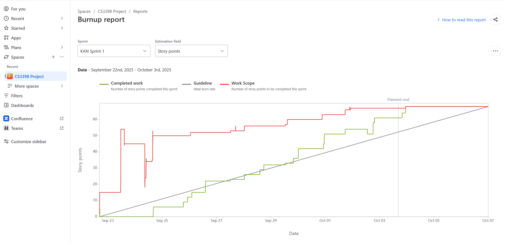

# bRUSH!
> Outline a brief description of your project.
> Live demo [_here_](https://www.example.com). <!-- If you have the project hosted somewhere, include the link here. -->
## Table of Contents
* [General Info](#general-information)
* [Technologies Used](#technologies-used)
* [Features](#features)
* [Screenshots](#screenshots)
* [Setup](#setup)
* [Usage](#usage)
* [Project Status](#project-status)
* [Room for Improvement](#room-for-improvement)
* [Acknowledgements](#acknowledgements)
* [Contact](#contact)
<!-- * [License](#license) -->

## Description  

**Who are we?**  
Hi! My name is [Meidad Troper](https://github.com/Meidad-T) and together with team members [Vaidic Soni](https://github.com/vaidicsoni), [Kelvin Mathew](https://github.com/KelvinMathew2004), [Priyanka Karki](https://github.com/pri682), and [Jesse Flynn](https://github.com/jeaflynn) we created bRUSH! The new social media app.  

**What are we creating?**  
In short, this is a mobile social media app that aims at connecting everyone to their creative side as well as connect people closer. The app is aimed at anyone ages 12 to 22 though we believe it will be enjoyable even among families, sharing drawings with your parents.  

bRUSH! is a mobile app inspired by BeReal, where all users world wide get a notification at the same time letting them know it is time to skecth! what are they bRUSHing? whatever the random, funny, bizzare, weird promt was generated for that day! every user, world wide - will all be drawing THE SAME THING at the SAME TIME talk about synchronization.... (sorry, bad programmer joke).  

Users will have a pre determined amount of time to complete their daily drawing. before they have to submit it.  

After a user has submitted their drawing, they are presented with all of their friends drawings! Again, same promt... and that is where the fun begin!  

each user is granted medals they can award each day.  
A gold medal can be awarded once per day, to the user's favorite drawing.  
A silver medal can be awarded once per day for the user's second favorite drawing.  
And of course a bronze medal can be awarded once per day for the user's third favorite bRUSH.  

In addition, every user is given an unlimited number of "participation medals" which they can award to all the drawings they hated.... Just kidding... they can be awarded to the drawings the user recognizes as impressive, but simply we'rent in the top 3 that day in the user's opinion.  

Each user grants those medals to their friends or family... but don't forget... the user also has the chance to be awarded medals of their own from their friends or family! resulting in a friendly and fun competition... who can earn the most gold medals?  

**Who are we doing it for?**  
The app is aimed at anyone ages 12 to 22 though we believe it will be enjoyable even among families, sharing drawings with your parents.  

**Why are we doing this?**  
Now, you might be hearing all of this... and wonder- but why? what's the point..? it doesn't really solve any global issue... it doesn't save lives, and it most certainly doesn't leave the world a better place... so what even if the point??  

Well... According to a recent research, About 45% of students world wide report wishing they had more opportunities to express themselves creatively or artistically but can't. It was also found that 80% of people believe unlocking creativity is critical to economic growth. [1]  

Our platform is just the place to do so. People of all ages could take their very own twist at our random bRUSH prompts, and truly express themselves in them. While the app aims to be fun and easy going, it also enables those students craving to express themselves the platform to do so, without being jujged.  

bRUSH! Aims to connect people, unlock creative thinking, and bring more color to the world (literally).  

## Technologies
- Swift UI
- XCode
- Firebase Authentication
- Firebase Cloud Storage
- Gemini API (Google AI)
- Apple Native APIs (Pencil Kit, photos UI, etc...)

## Features

Currently in progress as of October 6, 2025 (Next steps for sprint 2):
- Pick a personal profile page photo
- store drawings locally
- friend requests and leaderboard
- feed view
- medal awarding
- Liquid glass implemntation
- sign up user verification (verification codes)
- Notifications panel

## 🧩 Contributions

This section lists individual contributions for this sprint.  
Each entry includes the JIRA task ID, title, and links to related commits or pull requests.

---

### 👤 Meidad Troper

## Sprint 1:

#### **KAN-13 — Implement User Login**
- Implemented all user login logic including authentication flow and session persistence.  
🔗 [Bitbucket](https://bitbucket.org/cs3398-nemoidians-f25/brush/commits/branch/feature%2FKAN-13-user-login)

#### **KAN-53 — Implement User Sign Out**
- Added user sign-out functionality, restoring the app to its deafult, empty state.
🔗 [Bitbucket](https://bitbucket.org/cs3398-nemoidians-f25/brush/commits/branch/feature%2FKAN-53-log-out)

#### **KAN-14 — Allow User Profile Deletion**
- Implemented the ability for users to permanently delete their profiles and associated data.  
🔗 [Bitbucket](https://bitbucket.org/cs3398-nemoidians-f25/brush/commits/branch/feature%2FKAN-14-Delete-Profile)

#### **KAN-61 — Enable User Sign-Up for New Profiles**
- Developed the user registration process and linked it to the backend user store.  
🔗 [Bitbucket](https://bitbucket.org/cs3398-nemoidians-f25/brush/commits/branch/feature%2FKAN-61-sign-up-form)

#### **KAN-12 — Update User Profile Information**
- Implemented logic for user to update their profiles, including name and username.  
🔗 [Bitbucket](https://bitbucket.org/cs3398-nemoidians-f25/brush/commits/branch/feature%2FKAN-12-edit-profile-options)

## Sprint 2:
#### **KAN-106 — Allow Users to pick up a profile photo and set it as their own profile photo, customizing their account**
- Added logic to allow users to create their own profile pic in the form of an avatar. That avatar is built of different images overlaid on each other.
🔗 [Bitbucket](https://bitbucket.org/cs3398-nemoidians-f25/%7B57222da5-99b9-44b5-8ae7-38296988f7a4%7D/branch/KAN-106-sign-up-photo-picker)

#### **KAN-108 — Allow users to edit their profile photo through a button on their profile page**
- Added logic that allows users to edit their information after they signed up, in case there was a mistake during the initial setup or they simply want to refresh their profile.
🔗 [Bitbucket](https://bitbucket.org/cs3398-nemoidians-f25/%7B57222da5-99b9-44b5-8ae7-38296988f7a4%7D/branch/KAN-108-edit-profile-pic)

#### **KAN-109 — Add sketch animations to the log in page and make the sign in button less awkward**
- Added A sleek animation to the signin page that shows fun skecthes the users can make during their 
lifetime on the app.  
🔗 [Bitbucket](https://bitbucket.org/cs3398-nemoidians-f25/%7B57222da5-99b9-44b5-8ae7-38296988f7a4%7D/branch/KAN-109-sketch-animations)

#### **KAN-110 — Create the Profile UI in a way that is scaling correctly on all screen sizes**
- Implemented logic for thr Profile UI (cards, photo, etc) to scale correctly on all screen sizes.
For some reason, iPads had a bunch of issues. Mostly due to different aspect ratio.
🔗 [Bitbucket](https://bitbucket.org/cs3398-nemoidians-f25/%7B57222da5-99b9-44b5-8ae7-38296988f7a4%7D/branch/KAN-110-scaleable-UI)

#### **KAN-111 — Profile page retrieves the right medal count from the cloud when signed in**
- Added logic to revert hardcoded values and ensure card views in the profile page use real up-to-date cloud info. 
🔗 [Bitbucket](https://bitbucket.org/cs3398-nemoidians-f25/%7B57222da5-99b9-44b5-8ae7-38296988f7a4%7D/branch/KAN-111-profileCards-real-info)

#### **KAN-112 — Add a card that shows the streak, total drawings, and possibly other metric as we see fit**
- User profile has a third card for the streak, total drawings, and member since fields. this adds color and cool stats.
🔗 [Bitbucket](https://bitbucket.org/cs3398-nemoidians-f25/%7B57222da5-99b9-44b5-8ae7-38296988f7a4%7D/branch/KAN-112-streak-card)

#### **KAN-137 — Add Better Error Messages**
- Added Error Messages for things such as too long of a username, non-matching passwords, invalid email, etc... to allow better user exprienece
🔗 [Bitbucket](https://bitbucket.org/cs3398-nemoidians-f25/%7B57222da5-99b9-44b5-8ae7-38296988f7a4%7D/branch/KAN-137-gear-icon)

#### **KAN-138 — Move the SignOut and delete profile options to the gear icon settings to hide them**
- Moved the signout and delete account buttons into the gear menu for better layout and to ensure they aren't easily clickable by accident.
🔗 [Bitbucket](https://bitbucket.org/cs3398-nemoidians-f25/%7B57222da5-99b9-44b5-8ae7-38296988f7a4%7D/branch/KAN-138-move-action-buttons)

#### **KAN-139 — Add Better Error Messages**
- Added Error Messages for things such as too long of a username, non-matching passwords, invalid email, etc... to allow better user exprienece.
🔗 [Bitbucket](https://bitbucket.org/cs3398-nemoidians-f25/%7B57222da5-99b9-44b5-8ae7-38296988f7a4%7D/branch/KAN-139-add-better-error-messages)

## Sprint 3:

#### **KAN-145 — Add Human Avatar Options**
- Added Human avatar options, allowing users to create themselves instead of the "crack addict" looking ones as the team called them, lol.
🔗 [Bitbucket](https://bitbucket.org/cs3398-nemoidians-f25/brush/src/KAN-145-human-avatars/)

#### **KAN-152 — Add Unit Test for checking if user is signed in**
- Added the first of 3 unit tests. This one checks the state of the app when user is signed in to see if it tracks correctly.
🔗 [Bitbucket](https://bitbucket.org/cs3398-nemoidians-f25/brush/pull-requests/79)

#### **KAN-153 — Add Unit Test for sign out**
- Added The second of 3 Unit tests. This one was for the signout state of the app.
🔗 [Bitbucket](https://bitbucket.org/cs3398-nemoidians-f25/brush/pull-requests/80)

#### **KAN-154 — Add Unit Test to Test Password input length for error handling**
- Added The third of 3 Unit tests (and last one). This one was for the input length in the password field during signup.
🔗 [Bitbucket](https://bitbucket.org/cs3398-nemoidians-f25/brush/pull-requests/81)

#### **KAN-154 — Add Unit Test to Test Password input length for error handling**
- Added The second of 3 Unit tests. This one was for the input length in the password field during signup.
🔗 [Bitbucket](https://bitbucket.org/cs3398-nemoidians-f25/brush/pull-requests/81)

#### **KAN-157 — Add warning for password input field to ensure users know the minimum length is met**
- Added small logic that turns the password field red during signup when the password typed doesn't meet the minimum requirement length wise.
🔗 [Bitbucket](https://bitbucket.org/cs3398-nemoidians-f25/brush/pull-requests/76)

#### **KAN-158 — Ensure the Refresh Count button on the profile cards fits correctly for all screen sizes**
- Updated the UI code for the "refresh stats" button, that makes sure it doesn't overlap the cards on iPad.
🔗 [Bitbucket](https://bitbucket.org/cs3398-nemoidians-f25/brush/pull-requests/83)

#### **KAN-160 — Ensure the Gear Icon fits Better within the Profile Avatar View**
- Updated the UI of the geer icon to ensure it is better fitting the color theme of the app and username text. This has been changed to liquid glass later on by Kelvin as we discussed it might be better.
🔗 [Bitbucket](https://bitbucket.org/cs3398-nemoidians-f25/brush/pull-requests/73)

#### **KAN-185 — Increase AvatarModel readability and scale**
- Updated the Avatar Model from having hardcoded array elements (for example "hair_1, hair_2, hair_3, etc...) to useing an array map that goes from 1 to however many items we have, since every avatar option already follows the same naming convension. this allows to simply update the # (size) the map goes to when adding new options, instead of having to manually hardcode the added options.
🔗 [Bitbucket](https://bitbucket.org/cs3398-nemoidians-f25/brush/pull-requests/82)

#### **KAN-187 — Add Personalized Profile Share Cards**
- Added a "shared cards" feature, which allows user to share pre-made, up-to-date cards showing their stats such as streak count, total drawings, total medals, or even upload their own drawing and export these as an image, to share on social media.
🔗 [Bitbucket](https://bitbucket.org/cs3398-nemoidians-f25/brush/pull-requests/98)

#### **KAN-197 — Add a way to export the share cards as a video so it can be shared in a more "alive" way**
- Added a way to export the share cards as a video as well (previously was just an image), which captures both the card AND the animated background. This allows users to share a much more "alive" and vibrant showing of their achivements.
🔗 [Bitbucket](https://bitbucket.org/cs3398-nemoidians-f25/brush/pull-requests/102)

#### **KAN-200 — Add The Unit Tests plan**
- Added the plan for the unit tests as was required to in sprint assingment 14.
🔗 [Bitbucket](https://bitbucket.org/cs3398-nemoidians-f25/brush/pull-requests/105)

#### **Next Steps** 
 Update the app and get it ready for possible app store publication, as per the team's discussion!! 

---

### 👤 Kelvin Mathew

## Sprint 1:

#### **KAN-47 — Canvas for Drawings**
- Implemented UI and logic for for the canvas which can generate strokes based on touch input.
🔗 [Bitbucket Branch](https://bitbucket.org/cs3398-nemoidians-f25/brush/src/c0df58b05d29f08666e93cb2700f13fd3aae3691/?at=feature%2FKAN-47-canvas)

#### **KAN-48 — Custom PencilKit API**
- Implemented UI and logic for the customized Swift toolpicker that updates the drawing view.
🔗 [Bitbucket Branch](https://bitbucket.org/cs3398-nemoidians-f25/brush/src/b44f03882c33a1f2e24d68458ca5adaaa8f21dc1/?at=feature%2FKAN-48-as-a-user-i-want-to-choose-brush-)

#### **KAN-49 — Add Undo/Redo for iPhone**
- Implemented UI and logic for being able to undo and redo on iPhone due to the toolpicker not showing one unlike iPad.
🔗 [Bitbucket Branch](https://bitbucket.org/cs3398-nemoidians-f25/brush/src/3dac70e2a6db1c3ccf7be8bfe3b4a3265327abaa/?at=feature%2FKAN-49-as-a-user-i-want-to-undo-redo-act)

#### **KAN-50 — Add Share Sheet and Save Drawing Locally**
- Implemented UI and logic for creating the composite drawing, saving it in the local memory and being able to share it.
🔗 [Bitbucket Branch](https://bitbucket.org/cs3398-nemoidians-f25/brush/src/9658e3941ec9aa0e00aed71f977c344efc23cb37/?at=feature%2FKAN-50-as-a-user-i-want-to-export-the-ca)
🔗 [Bitbucket Pull Request](https://bitbucket.org/cs3398-nemoidians-f25/brush/pull-requests/2)

#### **KAN-65 — Enable Users to Change Canvas Backgrounds**
- Implemented UI and logic for being able to change the color of the canvas or pick from preset assets. Updated the export feature based on this.
🔗 [Bitbucket Branch](https://bitbucket.org/cs3398-nemoidians-f25/brush/src/c8ddfebd88d5af3fdb1cf0d4381a38f29f14f101/?at=feature%2FKAN-65-as-a-user-i-want-to-be-able-to-ch)
🔗 [Bitbucket Pull Request](https://bitbucket.org/cs3398-nemoidians-f25/brush/pull-requests/7)

## Sprint 2:

#### **KAN-120 — Canvas Timer Outline**
- Added an outline around the canvas that acts as a timer that changes the color while you draw.
🔗 [Bitbucket](https://cs3398-nemoidians-fall.atlassian.net/jira/software/projects/KAN/boards/1?jql=assignee%20%3D%20712020%3A6a04c9fd-c2b0-46b1-ac24-7fab7e78ffda&selectedIssue=KAN-120)

#### **KAN-121 — Dynamic Outline Color**
- Added logic that changess the color of the outline timer to show urgency.
🔗 [Bitbucket](https://bitbucket.org/cs3398-nemoidians-f25/%7B57222da5-99b9-44b5-8ae7-38296988f7a4%7D/branch/KAN-121-dynamic-outline-color)

#### **KAN-122 — Final Flash Animation**
- Added logic that flahses the color at the very end of the timer as a final warning.
🔗 [Bitbucket](https://bitbucket.org/cs3398-nemoidians-f25/%7B57222da5-99b9-44b5-8ae7-38296988f7a4%7D/branch/KAN-122-final-flash-animation)

#### **KAN-123 — Upload Drawings Upon Submission**
- Implemented logic to upload the shared submissions
🔗 [Bitbucket](https://bitbucket.org/cs3398-nemoidians-f25/%7B57222da5-99b9-44b5-8ae7-38296988f7a4%7D/branch/KAN-123-upload-drawings-upon-submission)

#### **KAN-124 — Early Submit Confirmation**
- Added a confirmation dialog when the user chooses to submit early.
🔗 [Bitbucket](https://bitbucket.org/cs3398-nemoidians-f25/%7B57222da5-99b9-44b5-8ae7-38296988f7a4%7D/branch/KAN-124-early-submit-confirmation)

#### **KAN-125 — Submission Animation**
- Added logic to show a success animation after submission.
🔗 [Bitbucket](https://bitbucket.org/cs3398-nemoidians-f25/%7B57222da5-99b9-44b5-8ae7-38296988f7a4%7D/branch/KAN-125-submission-animation)

#### **KAN-126 — Fix Compositing Bug**
- Resolve issues with combining drawing strokes and the background image.
🔗 [Bitbucket](https://bitbucket.org/cs3398-nemoidians-f25/%7B57222da5-99b9-44b5-8ae7-38296988f7a4%7D/branch/bugfix/KAN-126-fix-compositing-bug)

#### **KAN-127 — Fetch and Display Prompt**
- Retrieve the prompt from the feed and show it via the bulb icon during drawing.
🔗 [Bitbucket](https://bitbucket.org/cs3398-nemoidians-f25/%7B57222da5-99b9-44b5-8ae7-38296988f7a4%7D/branch/KAN-127-fetch-and-display-prompt)

#### **KAN-128 — Prompt Bubble Container**
- Added a bubble looking container for the prompt using liquid glass that closes when you click outside.
🔗 [Bitbucket](https://bitbucket.org/cs3398-nemoidians-f25/%7B57222da5-99b9-44b5-8ae7-38296988f7a4%7D/branch/KAN-128-prompt-bubble-container)

#### **KAN-129 — Save Prompt and Date**
- Added logic to store the prompt text and creation date locally with each drawing.
🔗 [Bitbucket](https://bitbucket.org/cs3398-nemoidians-f25/%7B57222da5-99b9-44b5-8ae7-38296988f7a4%7D/branch/KAN-129-save-prompt-and-date)

#### **KAN-130 — Enhanced Share Picker**
- Improve the share sheet to include “Save Image” and other social sharing options.
🔗 [Bitbucket](https://bitbucket.org/cs3398-nemoidians-f25/%7B57222da5-99b9-44b5-8ae7-38296988f7a4%7D/branch/KAN-130-enhanced-share-picker)

### **KAN-131 — Show Prompt in Preview**
- Added logic to save and show the old prompts in oldser drawings.
🔗 [Bitbucket](https://bitbucket.org/cs3398-nemoidians-f25/%7B57222da5-99b9-44b5-8ae7-38296988f7a4%7D/branch/KAN-131-show-prompt-in-preview)

#### **KAN-132 — Sprint 1 Demo Fixess**
- Fixed some issues that were found after the first demo. Removed unused/empty files, changed app name and display info, added variables, fixed styling, etc...
🔗 [Bitbucket](https://bitbucket.org/cs3398-nemoidians-f25/%7B57222da5-99b9-44b5-8ae7-38296988f7a4%7D/branch/hotfix/KAN-132-sprint-1-demo-fixes)

#### **KAN-134 — Enhanced Library Transitions**
- Used matchedGeometryEffect to smoothly transition between the grid view to the preview view.
(Note: Accidentally the commits for this task were made and linked to the https://cs3398-nemoidians-fall.atlassian.net/browse/KAN-125 branch.)
🔗 [Bitbucket](https://bitbucket.org/cs3398-nemoidians-f25/%7B57222da5-99b9-44b5-8ae7-38296988f7a4%7D/branch/KAN-134-enhanced-library-transitions)

#### **KAN-135 — Modify Document Path for Simulator**
- In the simulator’s app sandbox the images aren’t saved in a fixed directory, instead it's a relative path which changes upon rebuilding.
(Note: Accidentally the commits for this task were made and linked to the https://cs3398-nemoidians-fall.atlassian.net/browse/KAN-125 branch.)
🔗 [Bitbucket](https://bitbucket.org/cs3398-nemoidians-f25/%7B57222da5-99b9-44b5-8ae7-38296988f7a4%7D/branch/KAN-135-modify-document-path-for-simulat)

#### **KAN-140 — Single or Bulk Drawing Deletion**
- Drawings in the grid should be able to be long pressed to see the delete option. Also an edit button in the corner to select multiple drawings to delete.
🔗 [Bitbucket](https://bitbucket.org/cs3398-nemoidians-f25/%7B57222da5-99b9-44b5-8ae7-38296988f7a4%7D/branch/KAN-140-single-or-bulk-drawing-deletion)

#### **KAN-141 — Drawing Deletion Animation**
- Added Deletion Animation to the Drawing Page.
🔗 [Bitbucket](https://bitbucket.org/cs3398-nemoidians-f25/%7B57222da5-99b9-44b5-8ae7-38296988f7a4%7D/branch/KAN-141-drawing-deletion-animation)

## Sprint 3:

#### **KAN-149 — Sprint 2 Demo Fixes**
- Fixed issues found during the Sprint 2 Demo. Many small changes in many files.
🔗 [Bitbucket](https://bitbucket.org/cs3398-nemoidians-f25/brush/pull-requests/67)

#### **KAN-151 — Fix date mismatch in drawing uploads**
- Fixed a bug where the uploaded drawings had the wrong date on them.
This one does NOT have a branch since it was a hotfix. Dr lehr and I talked about this and settled the issue.

#### **KAN-171 — Profile Updates**
- Made dark mode more compatible for icons, stat cards, as well added a notch in avatar + fixed dark mode bugs in the editor.
🔗 [Bitbucket](https://bitbucket.org/cs3398-nemoidians-f25/brush/pull-requests/84)

#### **KAN-172 — Friends and Leaderboard Updates**
- Restructured the files to cleanly separate the backend from the UI, and added the current user to the leaderboard along with some visual fixes.
🔗 [Bitbucket](https://bitbucket.org/cs3398-nemoidians-f25/brush/pull-requests/70)

#### **KAN-173 — Past Drawings Grid and Preview Updates**
- Added a custom inner-shadow modifier for highlighting drawings, plus an average-color background with adaptive text.Also added single/multi share buttons and converted the old alerts into action sheets.
🔗 [Bitbucket](https://bitbucket.org/cs3398-nemoidians-f25/brush/pull-requests/71)

#### **KAN-182 — Custom Animations**
- I updated the animated mesh-gradient background for the feed and added a custom snow effect using the Vortex library, along with a new streak animation for daily drawings. I also refreshed the submission popup with a Lottie animation and created a custom launch-screen storyboard with responsive transitions for both iPhone and iPad.
🔗 [Bitbucket](https://bitbucket.org/cs3398-nemoidians-f25/brush/pull-requests/77)

#### **KAN-183 — Feed and Drawing View Updates**
- I improved feed performance with better caching, smoother scrolling, and new transitions, while expanding the profile and avatar features and fixing issues like side-indicator desync and medal limits. I also added new animations, faster notifications, and general styling refinements across the app.
🔗 [Bitbucket](https://bitbucket.org/cs3398-nemoidians-f25/brush/pull-requests/88)

#### **KAN-184 — Upgrade Profile Sheet**
- Updated the profile sheet with adaptive buttons and stat cards, made the Avatar View customizable as a mini PFP, and revamped the Add Friend view to show the profile sheet with an add option. I also prepped the system for future facial-hair options and a custom 3D avatar in the profile sheet.
🔗 [Bitbucket](https://bitbucket.org/cs3398-nemoidians-f25/brush/pull-requests/78)

#### **KAN-188 — Restoring and Simplifying Friends Fetching**
- I fixed the iPad profile-sheet scaling so everything renders correctly on large screens, restored the lost friend-fetching logic with a cleaner, more efficient approach, and polished the leaderboard with stable avatar placement, proper badge stacking, and full dark-mode support. I also improved loading behavior with cleaner redacted states and disabled interactions, and fully fixed profile deletion so friendships, requests, and sign-out all work correctly.
🔗 [Bitbucket](https://bitbucket.org/cs3398-nemoidians-f25/brush/pull-requests/93)

#### **KAN-186 — Drawings Unit Tests**
- Added unit tests for the drawings.
🔗 [Bitbucket](https://bitbucket.org/cs3398-nemoidians-f25/brush/pull-requests/97)

#### **KAN-195 — Fixed Issue Where FriendsView Was Not Refreshing Automatically**
- The friends tab now refreshes automatically when switching tabs (with pull-to-refresh supported), the friends view shows a real loading state, and feed blur logic correctly uses the streak’s last-completed date. Removing a friend from the profile sheet now updates both the feed and leaderboard just like the friends view.
🔗 [Bitbucket](https://bitbucket.org/cs3398-nemoidians-f25/brush/pull-requests/96)

#### **KAN-196 — Sprint 3 Demo Fixes Pt. 1**
- I rebuilt the card system so all text, sizes, and assets scale cleanly and stay consistent, overhauled the showcase and picker for better loading and export behavior, and fixed scrolling and indicator issues across the feed (including dark-mode quirks). I also cleaned up UI bugs by restoring redacted/avatar titles, fixing login layouts, updating notification badges, adding a leaderboard toast, and refreshing popovers.
🔗 [Bitbucket](https://bitbucket.org/cs3398-nemoidians-f25/brush/pull-requests/101)

#### **KAN-199 — Documenting Feed Unit Tests**
- Added the unit tests report as required in sprint assingment 14.
🔗 [Bitbucket](https://bitbucket.org/cs3398-nemoidians-f25/brush/pull-requests/104)

#### **KAN-189 — Sprint 3 Demo Fixes Pt. 2**
- Fixing a few issues for the upcoming spring such as card scaling on iPad, spacing adjutments, better dark mode support, and updating small UI elements for better visibility
🔗 [Bitbucket](https://bitbucket.org/cs3398-nemoidians-f25/%7B57222da5-99b9-44b5-8ae7-38296988f7a4%7D/branch/KAN-189-sprint-3-demo-fixes-2)

#### **Next Steps** 
Research how to publish the app on the app store and fix any issues as (and if) they rise.

---

### 👤 Vaidic Soni

#### **KAN-52 — Daily Reminder Functionality**
- Users now get periodic reminders every 2 hours to complete their daily drawing if they haven't done so.
🔗 [Bitbucket](https://bitbucket.org/cs3398-nemoidians-f25/brush/src/432d7255bac1e8b46ca891dae935610f734f8296/?at=feature%2FKAN-52-NotificationReminder)

#### **KAN-21 — Fixing notification Scheduling**
- Fixed notifications and made changes to make them better and increase their frequency.
🔗 [Bitbucket](https://bitbucket.org/cs3398-nemoidians-f25/brush/src/KAN-21_Fixing_Notifications/)

#### **KAN-23 — Added Streak functionality**
- Designed logic to track daily drawing streaks to motivate users.
🔗 [Bitbucket](https://bitbucket.org/cs3398-nemoidians-f25/brush/src/KAN-23-Streak_Feature/)

#### **KAN-45 — Added Notification Bell and History**
- Implemented a dropdown panel that stores and displays all past notifications.
🔗 [Bitbucket](https://bitbucket.org/cs3398-nemoidians-f25/brush/src/2437e02c6cc9a20d5537e9c8a60e27a40fbd7f72/?at=feature%2FKAN-45-as-a-user-i-want-a-bell-icon-on-t)

## Sprint 2:

#### **KAN-113 — Integrate Gemini API endpoint**
- Added logic to integrate Gemini API to generate daily drawing prompts
🔗 [Bitbucket](https://bitbucket.org/cs3398-nemoidians-f25/%7B57222da5-99b9-44b5-8ae7-38296988f7a4%7D/branch/KAN-113-integrate-gemini-api-endpoint)

#### **KAN-114 — Fetch generated prompt**
- Following KAN-113, Added logic to fetch the generated prompt.
🔗 [Bitbucket](https://bitbucket.org/cs3398-nemoidians-f25/%7B57222da5-99b9-44b5-8ae7-38296988f7a4%7D/branch/KAN-114-fetch-generated-prompt)

#### **KAN-115 — Implement post upload feature**
- Implement logic to upload the user's post feature.
🔗 [Bitbucket](https://bitbucket.org/cs3398-nemoidians-f25/%7B57222da5-99b9-44b5-8ae7-38296988f7a4%7D/branch/KAN-115-implement-post-upload-feature)

#### **KAN-116 — Add share/download option**
- Added options to share and or download options.
🔗 [Bitbucket](https://bitbucket.org/cs3398-nemoidians-f25/%7B57222da5-99b9-44b5-8ae7-38296988f7a4%7D/branch/KAN-116-add-share-download-option)

#### **KAN-117 — Fetch and display friend posts**
- Added main logic to fetch the friend's post and show them.
🔗 [Bitbucket](https://bitbucket.org/cs3398-nemoidians-f25/%7B57222da5-99b9-44b5-8ae7-38296988f7a4%7D/branch/KAN-117-fetch-and-display-friend-posts)

#### **KAN-118 — Added Streak functionality**
- Implemented backend data linking.
🔗 [Bitbucket](https://bitbucket.org/cs3398-nemoidians-f25/%7B57222da5-99b9-44b5-8ae7-38296988f7a4%7D/branch/KAN-118-implement-backend-data-linking)

#### **KAN-119 — Training the LLM on certain prompts**
- Trained the LLM on certain prompts by giving it examples.
🔗 [Bitbucket](https://bitbucket.org/cs3398-nemoidians-f25/%7B57222da5-99b9-44b5-8ae7-38296988f7a4%7D/branch/KAN-119-training-the-llm-on-certain-prom)

#### **Next Steps**
- Fixing notifications and streak.
- Implement a refresh function on the feed.
- Add necessary animations and UI changes.
---

### 👤 Priyanka Karki

#### **KAN-51 – Welcome Screen with Logo and Design Elements.**
Integrated the new logo into the welcome screen.
Added a “Get Started” button and aligned layout elements.
Ensured consistency and responsiveness across devices.
🔗 [Bitbucket](https://bitbucket.org/cs3398-nemoidians-f25/%7B57222da5-99b9-44b5-8ae7-38296988f7a4%7D/commits/2be9dcd5d70ad75b5ee7c49470d0fdc44b713405)

#### **KAN-63 – Home Feed Page.**
Built the main feed to display friends’ drawings.
Added navigation tabs for Home, Explore, Create, and Profile.
Structured layout for future backend integration.
🔗 [Bitbucket] (https://bitbucket.org/cs3398-nemoidians-f25/%7B57222da5-99b9-44b5-8ae7-38296988f7a4%7D/branch/feature/KAN-63-as-a-user-i-want-my-home-page-to-)

#### **KAN-64 – Profile Navigation.**
Enabled navigation from feed posts to creator profiles.
Added private profile visibility logic.
Tested smooth page transitions.
🔗 [Bitbucket](https://bitbucket.org/cs3398-nemoidians-f25/%7B57222da5-99b9-44b5-8ae7-38296988f7a4%7D/commits/19128ac3199010535bd6b2015dcdedc7a956b65b)

#### **KAN-71 – Post Interactions (Likes, Medals, Shares).**
Added interactive like, medal, and share buttons to feed posts.
Managed state updates and interaction animations.
Verified full integration within feed layout.
🔗 [Bitbucket](https://bitbucket.org/cs3398-nemoidians-f25/%7B57222da5-99b9-44b5-8ae7-38296988f7a4%7D/branch/KAN-71-as-a-user-i-want-to-be-able-to-ta)

###**(Sprint 2)**
#### **KAN-93 — Define how each post and its prompt should be structured in the full-screen “reels” layout**
Designed and implemented the foundational structure for displaying each post in a full-screen vertical layout, inspired by “reel”-style interactions.
Added layout logic ensuring proper alignment of post.
🔗 [Bitbucket](https://bitbucket.org/%7B66186e94-f0d3-491d-b1f8-de5a12208ffa%7D/%7B57222da5-99b9-44b5-8ae7-38296988f7a4%7D/pull-requests/63/diff)

#### **KAN-94 — Implement full-screen post layout with paging scroll**
Developed the main full-screen post view with seamless vertical paging scroll between posts.
Integrated smooth transition behavior for better UX consistency with Ripple effect
[Bitbucket](https://bitbucket.org/%7B66186e94-f0d3-491d-b1f8-de5a12208ffa%7D/%7B57222da5-99b9-44b5-8ae7-38296988f7a4%7D/pull-requests/66)

#### **KAN-96 — Implement uniform post layout and alignment across the feed**
Standardized layout and alignment for all feed posts to maintain consistent styling and spacing across devices.

[Bitbucket](https://bitbucket.org/%7B66186e94-f0d3-491d-b1f8-de5a12208ffa%7D/%7B57222da5-99b9-44b5-8ae7-38296988f7a4%7D/pull-requests/65)

#### **KAN-97 — Implement fixed prompt container at top of feed**
Added a fixed prompt container pinned to the top of the feed to display current drawing prompts.

[Bitbucket](https://bitbucket.org/%7B66186e94-f0d3-491d-b1f8-de5a12208ffa%7D/%7B57222da5-99b9-44b5-8ae7-38296988f7a4%7D/pull-requests/62)

#### **KAN-133 — Add a sticky post box at the top of the feed**
Created a sticky post input box that allows users to easily add new posts without scrolling.
[Bitbucket](https://bitbucket.org/%7B66186e94-f0d3-491d-b1f8-de5a12208ffa%7D/%7B57222da5-99b9-44b5-8ae7-38296988f7a4%7D/pull-requests/64)

#### **Next Steps (Sprint 3)**
Add swipe gesture support for navigating between full-screen posts.
Implement lazy loading and caching for smoother scrolling performance.
Enhance accessibility features, including dynamic text scaling and color contrast improvements.
Introduce basic feed analytics (view count, engagement tracking) - extra.
Fix share button logic to ensure consistent link generation and correct post sharing across devices.
Bug fixes: address minor visual inconsistencies in prompt alignment and post transitions.
---

### 👤 Jesse Flynn

## Sprint 1:

#### **KAN-18 - Friends Tab (View/Search/Request + Add Friend)**
- Implemented friend screen UI
- Added friend requests section with accept/decline functionality (mock)
- Added friends section with searchable list

🔗 [Bitbucket](https://bitbucket.org/cs3398-nemoidians-f25/brush/commits/branch/KAN-18-as-a-user-i-want-to-have-a-friends-tab-to-view-and-compete-with-my-friends)

#### **KAN-19 - Friends Leaderboard (frontend)**
- Added LeaderboardEntry model and LeaderboardService protocol
- Extended Friends VM with state, sorting, and refresh logic
- Added Leaderboard section in Friends page with ranking, points, refresh, and error/empty states
- Added trophy icon to toggle leaderboard visibility

🔗 [Bitbucket](https://bitbucket.org/cs3398-nemoidians-f25/brush/commits/branch/KAN-19-as-a-user-i-want-a-leaderboard-to-compete-with-friends)

*Note: KAN-18 (Friends tab) was accidentally merged into main instead of the sprint1-dev branch. As a result, when I created the KAN-19 branch and 
merged it into sprint1-dev, it also included the KAN-18 commits. These commits were already reviewed and merged to main earlier. KAN-19 contains only the 
leaderboard-related changes, but the history shows both sets because of the branch base. This was not an attempt to duplicate or fake work - just a branch 
merge mistake that I wanted to add here for clarity.*

## Sprint 2:

#### **KAN-100 — Add friend by @handle (Firebase)**
- Implemented friend search and add functionality using Firestore queries on `handle_lowercase`.
- Integrated HandleServiceFirebase and FriendRequestServiceFirebase for sending, accepting, and declining requests.
- Added bidirectional friendship creation under `/friendships/{uid}/friends/{friendUid}` upon acceptance.
- Connected UI (`AddFriendView`, `FriendsViewModel`) to reflect pending and accepted states.  
🔗 [Bitbucket](https://bitbucket.org/cs3398-nemoidians-f25/brush/commits/branch/KAN-100-add-friend-by-handle-firebase)

#### **KAN-102 — Incoming friend requests (Firebase)**
- Built Firestore logic to load incoming requests under `/friendRequests/{toUid}/incoming/{fromUid}`.
- Implemented accept/decline to create or remove friendship edges and update the Friends UI immediately.
- Added incoming requests section with action buttons.  
🔗 [Bitbucket](https://bitbucket.org/cs3398-nemoidians-f25/brush/commits/branch/KAN-102-incoming-friend-requests-firebas)

#### **KAN-104 — Friends-only leaderboard integration**
- Implemented `LeaderboardService` to aggregate medals from each friend’s user document.
- Updated LeaderboardEntry to store gold, silver, bronze, and computed total points (100/25/10 weights).
- Built horizontal bar chart UI where bar width reflects points relative to the top friend.  
🔗 [Bitbucket](https://bitbucket.org/cs3398-nemoidians-f25/brush/commits/branch/KAN-104-friends-only-leaderboard-integration)

#### **KAN-107 — Unit tests and fixes for friends**
- Added unit tests for FriendsViewModel covering add/remove logic, search filtering, and duplicate request guards.
- Fixed swipe-to-delete crash (List diff mismatch) by removing locally first, then deleting remotely.
- Tightened pending request logic to check both fromUid and toUid (per-current-user pending).  
🔗 [Bitbucket](https://bitbucket.org/cs3398-nemoidians-f25/brush/commits/branch/KAN-107-unit-tests-and-fixes-for-friends)

#### **KAN-147 — View a friend’s profile and delete friendship**
- Added tap gesture to open FriendProfileView sheet showing name, handle, and medals.
- Implemented friend removal from profile with confirmation and automatic sheet dismissal.
- Ensured bidirectional Firestore cleanup and refreshed Friends list on delete.  
🔗 [Bitbucket](https://bitbucket.org/cs3398-nemoidians-f25/brush/commits/branch/KAN-147-view-a-friends-profile-and-delete-friendship)

#### **Next Steps** 
- Enforce unique handle creation at signup to prevent duplicate display names.
- Exclude current user from search results to avoid self-add.
- Add leaderboard refresh and sorting unit tests.
- Strengthen Firestore rules to block self-requests entirely.

#### **Burnup chart for Sprint-1**

<!-- ## Setup

### Requirements

### Installation

## Usage
How does one go about using it?
Provide various use cases and code examples here.

`write-your-code-here`
 -->

## Project Status
Project is: _in progress_ 

<!-- ## Room for Improvement
Include areas you believe need improvement / could be improved. Also add TODOs for future development.

Room for improvement:
- Improvement to be done 1
- Improvement to be done 2

To do:
- Feature to be added 1
- Feature to be added 2

## Acknowledgements
Give credit here.
- This project was inspired by...
- This project was based on [this tutorial](https://www.example.com).
- Many thanks to...

## Contact
Created by [@flynerdpl](https://www.flynerd.pl/) - feel free to contact me!

<!-- Optional -->
<!-- ## License -->
<!-- This project is open source and available under the [... License](). -->

<!-- You don't have to include all sections - just the one's relevant to your project --> 